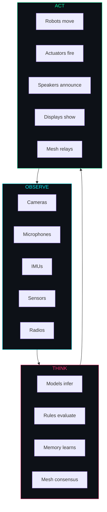
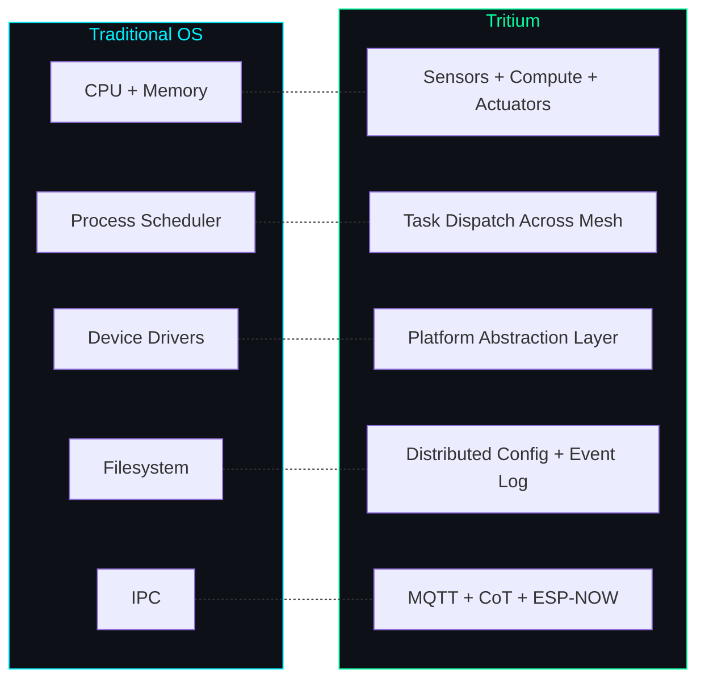
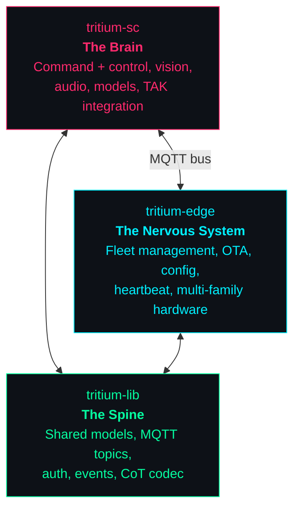
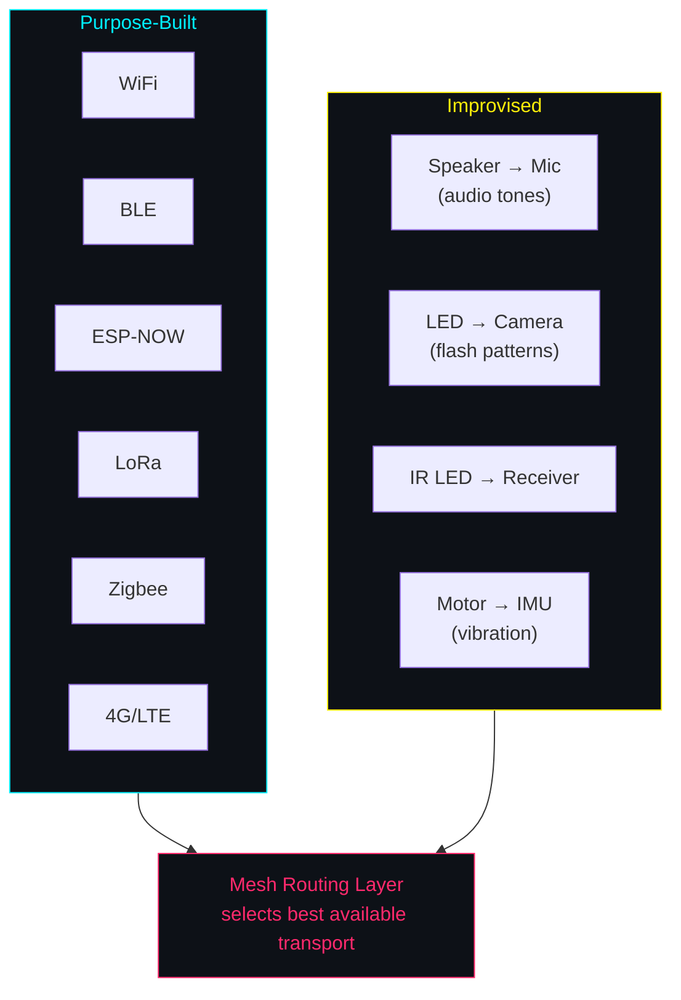
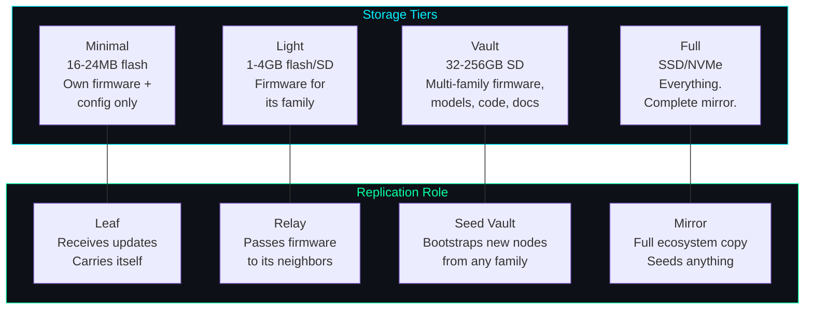
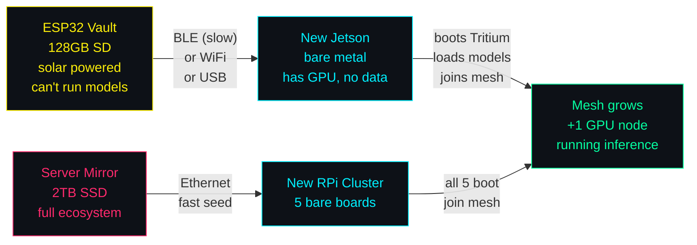

```
████████╗██████╗ ██╗████████╗██╗██╗   ██╗███╗   ███╗
╚══██╔══╝██╔══██╗██║╚══██╔══╝██║██║   ██║████╗ ████║
   ██║   ██████╔╝██║   ██║   ██║██║   ██║██╔████╔██║
   ██║   ██╔══██╗██║   ██║   ██║██║   ██║██║╚██╔╝██║
   ██║   ██║  ██║██║   ██║   ██║╚██████╔╝██║ ╚═╝ ██║
   ╚═╝   ╚═╝  ╚═╝╚═╝   ╚═╝   ╚═╝ ╚═════╝ ╚═╝     ╚═╝
```

<div align="center">

# A Distributed Cybernetic Operating System

**Observe. Think. Act.**

Every device is a node. Every node perceives. The mesh thinks together.

</div>

---

## The Problem

You have cameras, sensors, robots, radios, servers, phones, tablets — dozens
of devices from different manufacturers running different chips. Getting them
to **work together** means gluing APIs, writing adapters, babysitting
connections, and praying nothing crashes at 3am.

There is no operating system for a fleet of heterogeneous hardware. Until now.

## The Vision

Tritium turns every electronic device into a **neuron in a distributed brain**.
Cameras see. Microphones listen. Sensors measure. Models reason. Robots act.
The mesh connects them all through whatever channel is available — WiFi, BLE,
LoRa, even sound and light.



The feedback loop never stops. That's cybernetics — from Norbert Wiener's
*Cybernetics* (1948). Sensing, computation, action, repeat. Each device is a
loop. The mesh is a larger loop. Intelligence emerges from the network, not
from any single device.

## What Makes It an OS

An operating system manages resources, provides abstractions, and runs
applications. Tritium does this across a distributed fleet:



## The Three Pillars



| Pillar | Role | What It Does |
|--------|------|-------------|
| **tritium-sc** | The Brain | Battlespace management, Commander Amy, vision pipelines, target tracking, TAK bridge, simulation engine |
| **tritium-edge** | The Nervous System | Software Defined IoT. Manages fleets of ESP32, STM32, ARM Linux devices. OTA, config sync, heartbeat protocol |
| **tritium-lib** | The Spine | Shared library. Data models, MQTT topics, JWT auth, event bus, CoT XML codec. The contract that lets every node speak the same language |

## The Mesh Communicates Through Everything

> *"Life finds a way."* — And so will Tritium.

The mesh doesn't privilege any single radio. Every available channel is a
transport — purpose-built or improvised:



If a device has an output and another device has a matching sensor, that's a
communication channel. When primary transports fail, the mesh falls back
automatically. The feedback loop doesn't care about the medium — only that it
closes.

## The Mesh Replicates Itself

What a node can **compute** and what it can **carry** are different things.
A tiny ESP32 can't run a vision model, but with a SD card it becomes a
library that can't read its own books — and that's fine. When it meets a
Jetson that *can* read them, it hands them over. The mesh distributes not
just data, but the ability to grow.



| Tier | Storage | What It Carries | Example |
|------|---------|----------------|---------|
| **Minimal** | 16-24MB flash | Its own firmware + config | Bare ESP32 sensor node |
| **Light** | 1-4GB flash or SD | Firmware for its hardware family | ESP32 with small SD |
| **Vault** | 32-256GB SD | Multi-family firmware, model weights, configs, docs | ESP32 + big SD card |
| **Full mirror** | SSD / NVMe | Complete ecosystem: all firmware, all models, source code, docs | Jetson, RPi, server |

A **vault node** doesn't need to be powerful. It just needs storage. A
solar-powered ESP32 with a 128GB SD card buried in a field carries
firmware for every hardware family, model weights it will never run, and
the complete source code. When a new Jetson shows up on the mesh — even
over slow Bluetooth — the vault can seed it with everything: OS, models,
configs, the works. The Jetson boots, joins the mesh, and starts running
inference within minutes.



The replication is **opportunistic and incremental**. Nodes don't need to
carry everything — they carry what fits and share what they can. A minimal
node receives its own firmware updates. A vault seeds entire new deployments.
A full mirror replicates the whole ecosystem. The mesh decides what goes
where based on available storage, bandwidth, and what's needed.

This is biological. Spores, seeds, DNA. Not every cell carries the same
organelles, but the genome propagates. And because Tritium is **AGPL-3.0**,
the source code replicates too — not just technically through the mesh, but
legally through the license. Improve the code, share the code. The mesh
grows. The source grows with it.

## TAK Compatible

Every entity in the mesh — edge devices, robots, drones, detected targets —
generates MIL-STD-2045 CoT XML. The entire fleet is visible in any TAK client:
ATAK (Android), WinTAK (Windows), WebTAK (Browser).

## Quick Start

```bash
# Clone with submodules
git clone --recurse-submodules git@github.com:Valpatel/tritium.git
cd tritium

# Start the brain
cd tritium-sc && ./start.sh        # http://localhost:8000

# Start the nervous system
cd ../tritium-edge/server && ./start.sh   # http://localhost:8080

# Both bridge automatically via MQTT
```

## Design Philosophy

> *"The ultimate goal of farming is not the growing of crops, but the
> cultivation and perfection of human beings."* — Masanobu Fukuoka

You don't micromanage every sensor and every robot. You define the intent —
the profiles, the routes, the policies — and the system self-organizes.

- **Feedback loops everywhere.** Sense → compute → act → sense. The loop never stops.
- **Distributed by default.** No single point of failure. Nodes work independently when disconnected.
- **Software defined.** Same hardware, different behavior. Change the config, change the device.
- **Heterogeneous.** ESP32, STM32, Raspberry Pi, Jetson, phone, desktop — if it speaks heartbeat, it's a node.
- **Self-replicating.** Every node carries the genome — firmware, configs, models, code. New nodes bootstrap from any existing node. The mesh grows itself.
- **AGPL-3.0.** The license *is* the philosophy. The code must remain open. If you improve it, you share it. The mesh spreads, and so does the source.
- **Observable.** Every node reports health. Every command is logged. Every firmware is attested.
- **No cloud.** Everything runs on your hardware, on your network. No subscriptions. No telemetry phoning home.

## Deeper Documentation

| Document | Location |
|----------|----------|
| tritium-sc architecture | `tritium-sc/docs/` |
| tritium-edge architecture | `tritium-edge/docs/ARCHITECTURE.md` |
| Device protocol (heartbeat v2) | `tritium-edge/docs/DEVICE-PROTOCOL.md` |
| Multi-tenant design | `tritium-edge/docs/MULTI-TENANT.md` |
| Hardware abstraction (PAL) | `tritium-edge/docs/HARDWARE-ABSTRACTION.md` |
| Plugin system | `tritium-edge/docs/PLUGIN-SYSTEM.md` |
| Integration guide | `tritium-edge/docs/INTEGRATION.md` |
| Shared library (tritium-lib) | `tritium-lib/README.md` |

---

<div align="center">

*The mesh observes through a thousand eyes.*
*The mesh thinks with distributed intelligence.*
*The mesh acts through every connected device.*

*No cloud. No subscriptions. No single point.*
*The network is the computer.*

*Created by Matthew Valancy / Copyright 2026 Valpatel Software LLC / AGPL-3.0*

</div>
