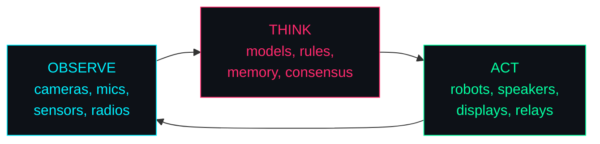
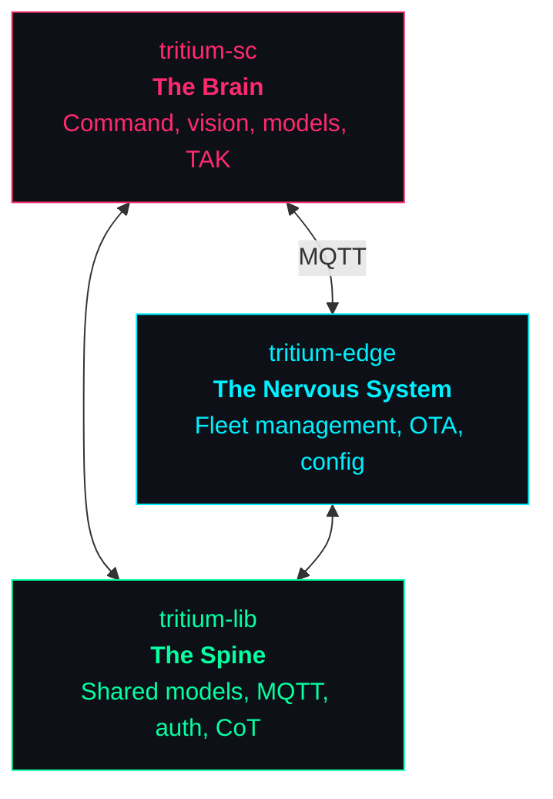
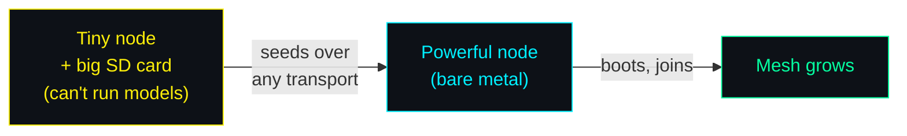
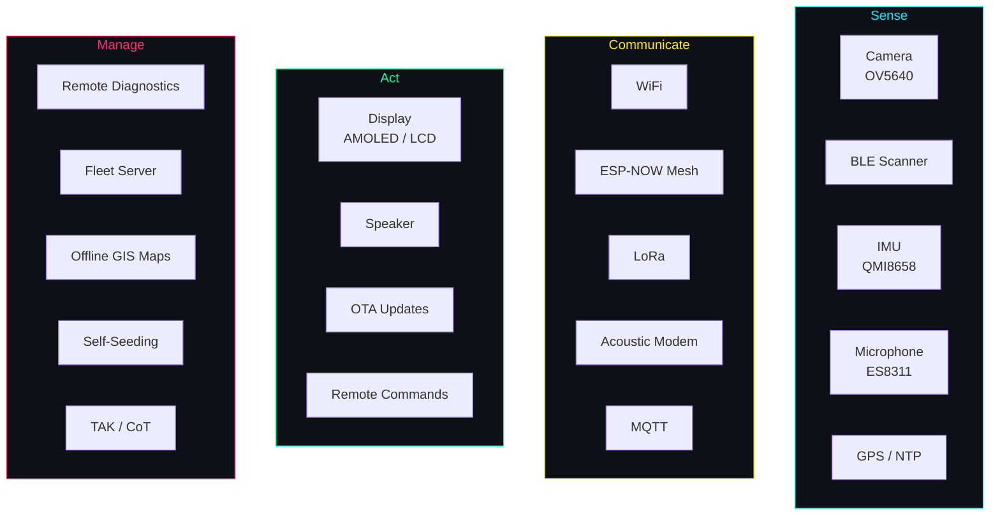

```
████████╗██████╗ ██╗████████╗██╗██╗   ██╗███╗   ███╗
╚══██╔══╝██╔══██╗██║╚══██╔══╝██║██║   ██║████╗ ████║
   ██║   ██████╔╝██║   ██║   ██║██║   ██║██╔████╔██║
   ██║   ██╔══██╗██║   ██║   ██║██║   ██║██║╚██╔╝██║
   ██║   ██║  ██║██║   ██║   ██║╚██████╔╝██║ ╚═╝ ██║
   ╚═╝   ╚═╝  ╚═╝╚═╝   ╚═╝   ╚═╝ ╚═════╝ ╚═╝     ╚═╝
```

<div align="center">

# A Distributed Cybernetic Operating System

**Observe. Think. Act.**

Every device is a node. Every node perceives. The mesh thinks together.

</div>

---

## The Problem

You have cameras, sensors, robots, radios, servers, phones, tablets — dozens
of devices from different manufacturers running different chips. Getting them
to **work together** means gluing APIs, writing adapters, babysitting
connections, and praying nothing crashes at 3am.

There is no operating system for a fleet of heterogeneous hardware. Until now.

## The Vision

Tritium turns every electronic device into a **neuron in a distributed brain**.
Cameras see. Microphones listen. Sensors measure. Models reason. Robots act.
The mesh connects them all through whatever channel is available — WiFi, BLE,
LoRa, even sound and light.



The feedback loop never stops. That's cybernetics — from Norbert Wiener's
*Cybernetics* (1948). Each device is a loop. The mesh is a larger loop.

## The Three Pillars



| Pillar | What It Does |
|--------|-------------|
| [**tritium-sc**](https://github.com/Valpatel/tritium-sc) | Battlespace management, Commander Amy, vision pipelines, target tracking, TAK bridge, simulation |
| [**tritium-edge**](https://github.com/Valpatel/tritium-edge) | Software Defined IoT — manages fleets of ESP32, STM32, ARM Linux devices. OTA, config sync, heartbeat |
| [**tritium-lib**](https://github.com/Valpatel/tritium-lib) | Shared contract — data models, MQTT topics, JWT auth, event bus, CoT XML codec |

## Core Principles

> *"Life finds a way."* — And so will Tritium.

**Communicates through everything.** WiFi, BLE, LoRa, ESP-NOW, Zigbee, 4G —
and improvised channels too. A speaker and a microphone become an
[acoustic modem](https://github.com/Valpatel/tritium-edge/blob/dev/docs/ACOUSTIC_MODEM.md).
A flashing LED and a camera are a data link. If a device has an output and
another has a matching sensor, that's a transport. The mesh finds a way.

**Self-replicating.** What a node can compute and what it can carry are
different things. A tiny ESP32 can't run a vision model, but with a SD card
it carries firmware, models, configs — even the source code. When it meets a
Jetson, it seeds it. Nodes with spare storage act as blind couriers — holding
encrypted data they can't read, reclaiming space when needed. The mesh grows
itself.



**TAK compatible.** Every entity generates MIL-STD-2045 CoT XML. The entire
fleet is visible in ATAK, WinTAK, and WebTAK.

**No cloud.** Everything runs on your hardware, on your network. No
subscriptions. No telemetry phoning home.

**AGPL-3.0.** The license *is* the philosophy. The code must remain open. The
mesh spreads, and so does the source.

## Capabilities



| Capability | Description |
|-----------|-------------|
| **Remote Diagnostics** | Health snapshots every 30s — memory, power, temperature, per-slave I2C, WiFi, camera, touch, NTP. Anomaly detection flags memory leaks, battery drain, sensor failures. Fleet-wide aggregation with heap trend analysis. NVS crash tracking for post-mortem analysis. Persistent event ring buffer on LittleFS. |
| **Acoustic Modem** | FSK data-over-audio using ESP32 I2S speaker/mic. Covert or backup channel when RF is unavailable. |
| **ESP-NOW Mesh** | Multi-hop flooding mesh with dedup, neighbor discovery, and route quality metrics. Works without WiFi AP. |
| **Offline GIS** | OSM slippy map tiles stored on SD card. MBTiles import. LRU tile cache in PSRAM. Street maps and satellite imagery without internet. |
| **Self-Seeding** | Nodes carry firmware + configs + models on SD card. New nodes bootstrap from any peer over any transport. SHA-256 verified. |
| **TAK Integration** | MIL-STD-2045 Cursor-on-Target XML. Every node visible in ATAK, WinTAK, WebTAK. UDP multicast + TCP streaming. |
| **7-Path OTA** | WiFi push/pull, BLE, serial, SD card, mesh relay, USB, HTTP. Dual partition with automatic rollback. |
| **Fleet Provisioning** | Discover, commission, bulk-configure. Web UI, serial, SD card, and BLE commissioning paths. |

## Communication Stack

Tritium nodes negotiate the best available transport automatically:

| Layer | Transport | Range | Bandwidth | Use Case |
|-------|-----------|-------|-----------|----------|
| **WiFi** | 802.11 b/g/n | ~50m | High | Primary data, OTA, web UI |
| **ESP-NOW** | 802.11 LR | ~200m | 250 Kbps | Mesh relay, no AP needed |
| **BLE** | BLE 5.0 | ~30m | 2 Mbps | Presence detection, commissioning |
| **LoRa** | SX1262/76 | ~10km | 0.3-50 Kbps | Long range, low power telemetry |
| **MQTT** | TCP/IP | WAN | High | Server bridge, cloud-optional |
| **Acoustic** | FSK audio | ~10m | ~100 bps | Covert/backup when RF denied |

When a transport fails, the mesh routes through whatever remains. ESP-NOW
mesh provides multi-hop relay without infrastructure. The acoustic modem
is the transport of last resort — if a device has a speaker and another
has a microphone, data flows.

## Quick Start

```bash
git clone --recurse-submodules git@github.com:Valpatel/tritium.git
cd tritium

cd tritium-sc && ./start.sh              # The Brain → http://localhost:8000
cd ../tritium-edge/server && ./start.sh  # The Nervous System → http://localhost:8080
# Both bridge automatically via MQTT
```

## Go Deeper

Each sub-repo has detailed documentation in its `docs/` folder:

| Topic | Where |
|-------|-------|
| System architecture | [tritium-edge/docs/ARCHITECTURE.md](https://github.com/Valpatel/tritium-edge/blob/dev/docs/ARCHITECTURE.md) |
| Device protocol | [tritium-edge/docs/DEVICE-PROTOCOL.md](https://github.com/Valpatel/tritium-edge/blob/dev/docs/DEVICE-PROTOCOL.md) |
| Multi-tenant design | [tritium-edge/docs/MULTI-TENANT.md](https://github.com/Valpatel/tritium-edge/blob/dev/docs/MULTI-TENANT.md) |
| Hardware abstraction | [tritium-edge/docs/HARDWARE-ABSTRACTION.md](https://github.com/Valpatel/tritium-edge/blob/dev/docs/HARDWARE-ABSTRACTION.md) |
| Acoustic modem | [tritium-edge/docs/ACOUSTIC_MODEM.md](https://github.com/Valpatel/tritium-edge/blob/dev/docs/ACOUSTIC_MODEM.md) |
| Meshtastic integration | [tritium-edge/docs/MESHTASTIC_INTEGRATION.md](https://github.com/Valpatel/tritium-edge/blob/dev/docs/MESHTASTIC_INTEGRATION.md) |
| GIS + web server | [tritium-edge/docs/GIS_WEBSERVER_INTEGRATION.md](https://github.com/Valpatel/tritium-edge/blob/dev/docs/GIS_WEBSERVER_INTEGRATION.md) |
| ESP32 ecosystem | [tritium-edge/docs/ESP32_LIBRARY_ECOSYSTEM.md](https://github.com/Valpatel/tritium-edge/blob/dev/docs/ESP32_LIBRARY_ECOSYSTEM.md) |
| Device commissioning | [tritium-edge/docs/COMMISSIONING.md](https://github.com/Valpatel/tritium-edge/blob/dev/docs/COMMISSIONING.md) |
| Plugin system | [tritium-edge/docs/PLUGIN-SYSTEM.md](https://github.com/Valpatel/tritium-edge/blob/dev/docs/PLUGIN-SYSTEM.md) |
| Shared library | [tritium-lib/README.md](https://github.com/Valpatel/tritium-lib) |
| Simulation & TAK | [tritium-sc/docs/TAK.md](https://github.com/Valpatel/tritium-sc/blob/dev/docs/TAK.md) |

---

<div align="center">

*No cloud. No subscriptions. No single point. The network is the computer.*

*Created by Matthew Valancy / Copyright 2026 Valpatel Software LLC / AGPL-3.0*

</div>
